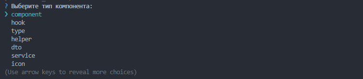
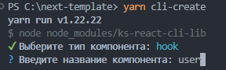
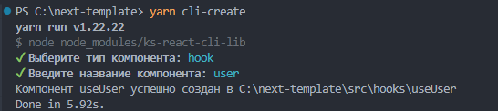

# KS REACT CLI

## Why?

Standardization of processes and availability of ready-made components can significantly reduce the time spent on application development and support.
When creating an item, depending on its type, our library will place it according to our style guide.


## Get Started:

Install the package:

```
npm i -D ks-react-cli-lib
```

Add the script to your `package.json`:

```json
{
  "scripts": {
    "cli-create" : "node node_modules/ks-react-cli-lib"
  }
}
```

Launch the library:

```
npm run cli-create
```

Select the type of item to create:




Enter the name:



That's it, the item has been successfully created!!!



## Config 

We are currently developing the ability to configure files ourselves.
It is currently being created `.css` file, if necessary, and `.ts(x)` files.
You will also be able to change the element creation path in the future.

## Default template

### Shared files:

`index.ts`

``` ts
export * from "./ComponentName";
```

`ComponentName.module.css`

``` css
.root {}
```

### Component: 

name : `box`

``` tsx
import React from "react";
    
import style from "./Box.module.css";
     
export interface BoxProps {}       
    
export const Box = ({}: BoxProps) => {
  return <div className={style.root}></div>;
};
```


### Hook:

name: `user`

prefix is added automatically

``` tsx 
import React from "react";
    
export const useUser = () => {
  console.log("custom hook useUser");
};
```
### Type:

name: `user`

``` ts
export type User = {}
```

### Helper:

name: `user`
suffix is added automatically

``` ts
export class UserHelper {}
```

### DTO:

name : `user`

suffix is added automatically

``` ts
export class UserDto {
    serialize<T>(): Record<string, T> {
    const dto: Record<string, T> = Object.assign(this);

    Object.keys(dto).forEach(key => {
      if (dto[key] === undefined) {
      delete dto[key];
      }
    });

      return dto;
    }
}
```

### Service:
name : `user`

suffix is added automatically

``` ts
export class UserService {}
```

### Icon: 

name: `arrow`

prefix is added automatically

``` tsx
import React from "react"
interface IconArrowProps extends React.SVGProps<SVGSVGElement> {}

export const IconArrow = (props: IconArrowProps) => ();
```

### Page (screen):

name: `main`

``` ts
import React from "react";
    
import style from "./MainScreen.module.css";
    
   
export interface $MainScreenProps {}       

    
export const MainScreen = ({}: MainScreenProps) => {
  return <div className={style.root}></div>;
};
```

### Context:

name: `root`

``` tsx 
import React from "react";
export type RootProviderProps = {
  children: React.ReactNode;
};

export const RootContext = React.createContext({});

export const  RootProvider = ({children}:  RootProviderProps) => {

  return  (
    <RootContext.Provider
      value={{}}
    >
      {children}
    </RootContext.Provider>
  );
}
```

## License

Generate React CLI is an open source software [licensed as MIT](https://github.com/Korotkov-S/react-cli/blob/main/LICENSE).
